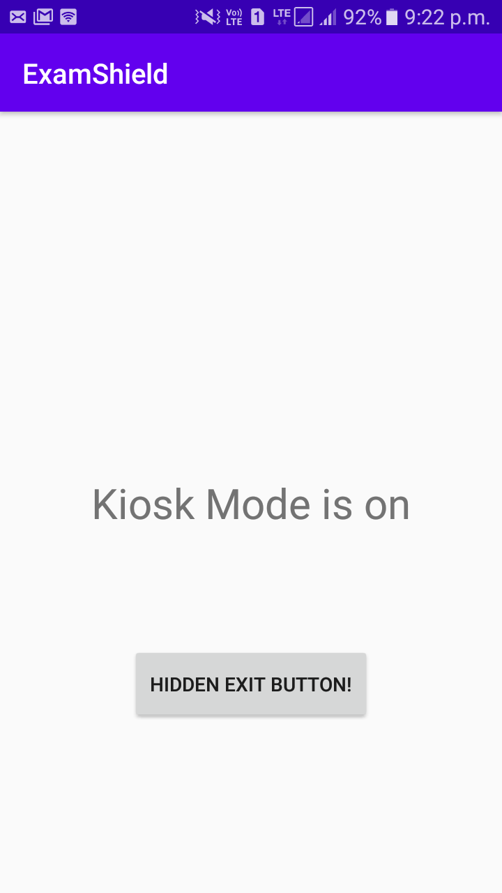
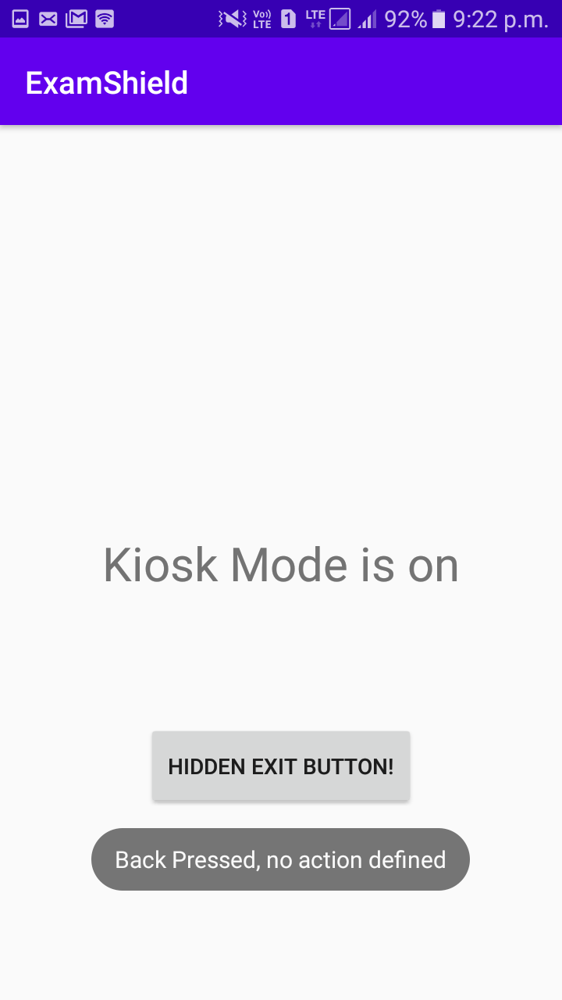
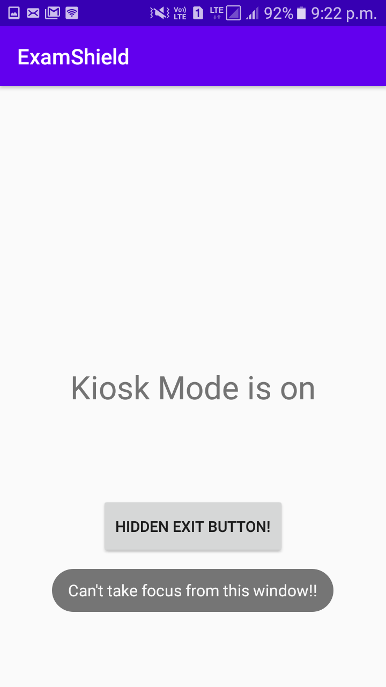
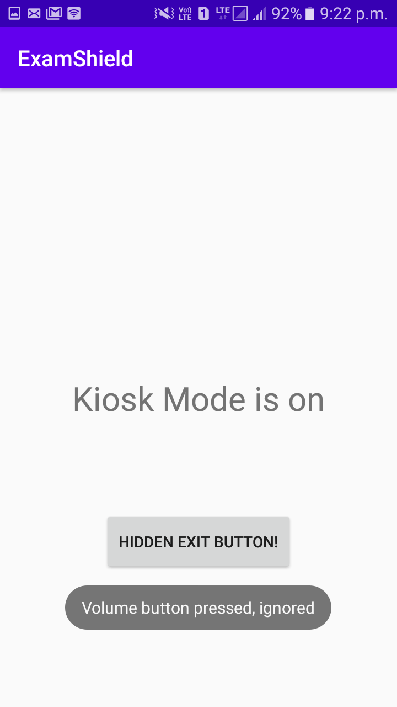

# Exam Shield: The secure exam app

This is an android app that will let you take your exams online using your own smartphones in a secure manner.
The basic idea behind is that, the moment you open this app your phone will enter a kiosk mode where only this app will work and you won't be able to access any other feature of your smartphone.
Also, the app will connect to your online examination link and like a single tab browser you will be able to take your exam.
After you have completed your exam, you can exit the app.

## Installation Instructions

Go to the [releases](https://github.com/Sudhanshu-Dubey14/ExamShield/releases) and download the apk (present inside the zip) of the latest release.
Then install that apk into your smartphone.

## Usage instructions

Currently, the app is in development phase. We are making it so that once you have entered the app, you can't leave it unless you press the "Hidden Exit Button" (which isn't hidden for now).
You can find more regarding the current features on the app and usage instructions in the release page.

## Screenshots

Currently the app looks something like this:

<figure>

<figcaption>Home Screen of App</figcaption>

<figcaption>When back button is pressed</figcaption>

<figcaption>When a dialog tries to casts over the screen (ex. notification bar exapansion, long power button press)</figcaption>

<figcaption>When Volume keys are pressed</figcaption>
</figure>
